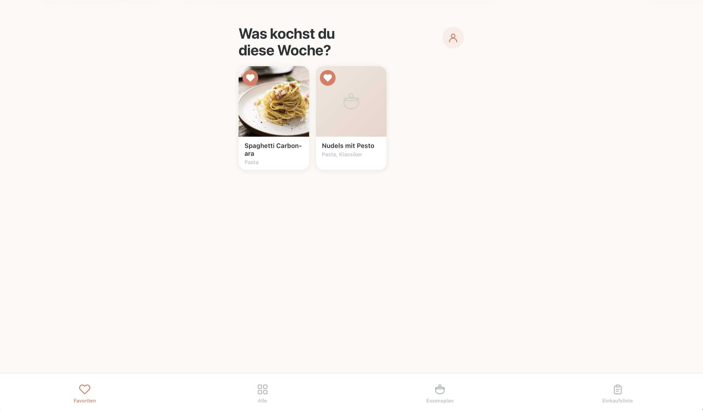
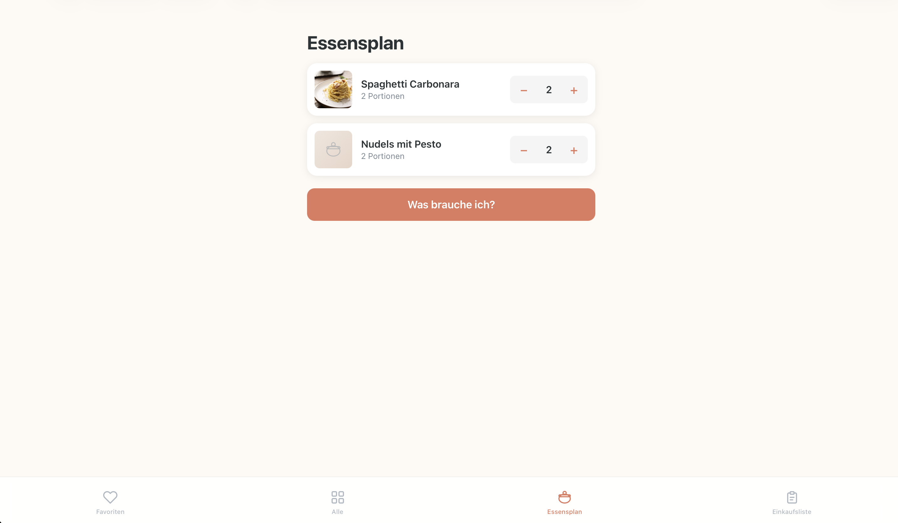
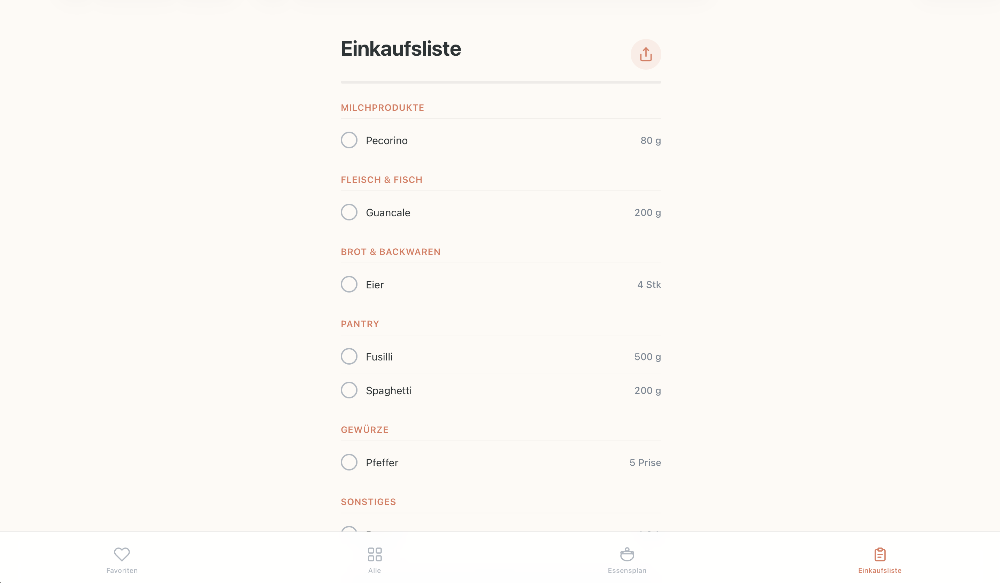

# Essenszeit

**Plane deine Woche. Koche mit Plan. Kaufe ohne Chaos.**

[Live-App ausprobieren](https://essenszeits.vercel.app)

`PWA` · `Vanilla JS` · `Supabase`

---

<p align="center">
  
  
  
</p>

---

## Was ist Essenszeit?

Essenszeit ist eine Meal-Planning-App fuer den Alltag. Du verwaltest deine Lieblingsgerichte, planst damit deine Woche und bekommst automatisch eine fertige Einkaufsliste -- sortiert nach Supermarkt-Kategorie. Kein Zettelchaos, kein Vergessen, kein Stress.

## Funktionen

### Gerichtesammlung
Eigene Gerichte anlegen mit Foto, Tags und Zutaten. Durchsuchen und filtern nach Kategorien.

### Favoriten
Lieblingsgerichte mit Herz markieren fuer schnellen Zugriff.

### Essensplan
Gerichte fuer die Woche auswaehlen und Portionen per Stepper (+/−) anpassen.

### Einkaufsliste
Automatische Konsolidierung aller Zutaten nach Kategorie (Obst & Gemuese, Milchprodukte, Fleisch & Fisch, ...). Fortschrittsbalken beim Abhaken und Teilen-Funktion.

### Cloud Sync
Geraeteuebergreifend synchronisiert ueber Supabase. Offline nutzbar dank Service Worker.

### Installierbar
Als PWA direkt auf den Homescreen installierbar -- iOS und Android.

### 10 Beispielgerichte
Sofort loskochbar nach Registrierung. Von Spaghetti Bolognese bis Flammkuchen.

## Tech Stack

| Frontend | Backend | Hosting |
|---|---|---|
| Vanilla HTML/CSS/JS | [Supabase](https://supabase.com) (Postgres + Auth + RLS) | [Vercel](https://vercel.com) |

## Selbst ausprobieren

Oeffne die [Live-App](https://essenszeits.vercel.app), erstelle ein Konto und leg los. 10 Beispielgerichte werden automatisch angelegt.

## Auf dem iPhone installieren

Oeffne die [Live-App](https://essenszeits.vercel.app) in Safari, tippe auf das Teilen-Symbol und waehle **"Zum Home-Bildschirm"**. Essenszeit wird dann wie eine native App im Vollbildmodus gestartet -- ohne Adressleiste, mit eigenem Icon.

## Lokale Entwicklung

```sh
npx serve essenszeit-pwa
```

Supabase-Keys (`SUPABASE_URL`, `SUPABASE_ANON_KEY`) in `index.html` setzen. Datenbankschema: `supabase-setup.sql` im Supabase SQL-Editor ausfuehren.
